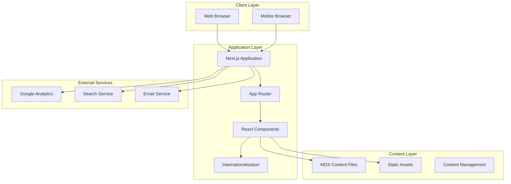

# Design Document - Food Safety Website

## Overview

The Food Safety Website will be built as a modern, responsive web application using a component-based architecture. The system will consist of a static site generator approach for optimal performance and SEO, with dynamic features for user interaction. The design prioritizes user experience, accessibility, content discoverability, and compliance with data protection regulations.

### Technology Stack Recommendation

- **Frontend Framework**: Next.js 14+ (React-based) with App Router
- **Styling**: CSS Modules with SCSS for component-scoped styling
- **Content Management**: MDX for blog posts and educational content
- **Search**: Algolia or local search implementation with Fuse.js
- **Analytics**: Google Analytics 4 with cookie consent management
- **Internationalization**: next-intl for multi-language support
- **Forms**: React Hook Form with Zod validation
- **Deployment**: Vercel or similar edge platform for optimal performance

## Architecture

### High-Level Architecture



### Application Structure

```
food-safety-website/
├── src/
│   ├── app/                    # Next.js App Router pages
│   │   ├── [locale]/          # Internationalized routes
│   │   │   ├── layout.tsx     # Root layout
│   │   │   ├── page.tsx       # Homepage
│   │   │   ├── about/         # About page
│   │   │   ├── blog/          # Blog listing and posts
│   │   │   ├── guides/        # Educational guides
│   │   │   ├── faq/           # FAQ page
│   │   │   └── contact/       # Contact form
│   │   └── api/               # API routes
│   │       ├── contact/       # Contact form handler
│   │       └── search/        # Search endpoint
│   ├── components/            # React components
│   │   ├── layout/           # Layout components
│   │   ├── ui/               # Reusable UI components
│   │   ├── content/          # Content-specific components
│   │   └── forms/            # Form components
│   ├── lib/                  # Utility functions
│   │   ├── content.ts        # Content loading utilities
│   │   ├── search.ts         # Search implementation
│   │   └── analytics.ts      # Analytics helpers
│   ├── styles/               # Global styles
│   └── content/              # MDX content files
│       ├── blog/             # Blog posts
│       ├── guides/           # Educational guides
│       └── pages/            # Static pages content
├── public/                   # Static assets
│   ├── images/
│   ├── videos/
│   └── documents/
├── messages/                 # i18n translation files
│   ├── tr.json
│   └── en.json
└── config/                   # Configuration files
```

## Components and Interfaces

### Core Components

#### 1. Layout Components

**Header Component**
- Responsive navigation menu
- Language selector
- Search bar (desktop)
- Mobile menu toggle
- Logo and branding

**Footer Component**
- Quick links to main sections
- Social media links
- Legal links (privacy, terms, cookies)
- Contact information
- Newsletter subscription

**Navigation Component**
- Multi-level menu support
- Active state indication
- Mobile-responsive drawer
- Accessibility features (ARIA labels, keyboard navigation)

#### 2. Content Components

**BlogCard Component**
```typescript
interface BlogCardProps {
  title: string;
  excerpt: string;
  publishDate: Date;
  author: string;
  category: string;
  slug: string;
  image?: string;
  readTime: number;
}
```

**GuideCard Component**
```typescript
interface GuideCardProps {
  title: string;
  description: string;
  icon: string;
  difficulty: 'beginner' | 'intermediate' | 'advanced';
  topics: string[];
  slug: string;
}
```

**FAQItem Component**
```typescript
interface FAQItemProps {
  question: string;
  answer: string;
  category: string;
  isExpanded?: boolean;
}
```

**CertificationDisplay Component**
```typescript
interface CertificationProps {
  name: string;
  issuer: string;
  date: Date;
  image: string;
  verificationUrl?: string;
}
```

#### 3. Interactive Components

**SearchBar Component**
```typescript
interface SearchBarProps {
  placeholder: string;
  onSearch: (query: string) => void;
  suggestions?: SearchSuggestion[];
  isLoading?: boolean;
}

interface SearchSuggestion {
  title: string;
  type: 'blog' | 'guide' | 'faq' | 'page';
  url: string;
}
```

**ContactForm Component**
```typescript
interface ContactFormData {
  name: string;
  email: string;
  subject: string;
  message: string;
  consent: boolean;
}

interface ContactFormProps {
  onSubmit: (data: ContactFormData) => Promise<void>;
  locale: string;
}
```

**Quiz Component**
```typescript
interface QuizQuestion {
  id: string;
  question: string;
  options: string[];
  correctAnswer: number;
  explanation: string;
}

interface QuizProps {
  title: string;
  questions: QuizQuestion[];
  onComplete: (score: number) => void;
}
```

**CommentSection Component**
```typescript
interface Comment {
  id: string;
  author: string;
  content: string;
  date: Date;
  replies?: Comment[];
}

interface CommentSectionProps {
  postId: string;
  comments: Comment[];
  onSubmit: (comment: string) => Promise<void>;
}
```

#### 4. Utility Components

**LanguageSwitcher Component**
- Dropdown or toggle for language selection
- Persists preference to localStorage
- Updates URL with locale parameter

**CookieConsent Component**
- GDPR/KVKK compliant banner
- Granular consent options
- Preference management

**ShareButtons Component**
- Social media sharing (Twitter, Facebook, LinkedIn, WhatsApp)
- Copy link functionality
- Native share API support for mobile

## Data Models

### Content Models

**BlogPost**
```typescript
interface BlogPost {
  slug: string;
  title: string;
  excerpt: string;
  content: string; // MDX content
  publishDate: Date;
  updateDate?: Date;
  author: Author;
  category: Category;
  tags: string[];
  featuredImage?: string;
  readTime: number;
  seo: SEOMetadata;
}
```

**Guide**
```typescript
interface Guide {
  slug: string;
  title: string;
  description: string;
  content: string; // MDX content
  difficulty: 'beginner' | 'intermediate' | 'advanced';
  topics: string[];
  relatedStandards: string[]; // e.g., "HACCP", "ISO 22000"
  lastUpdated: Date;
  seo: SEOMetadata;
}
```

**FAQ**
```typescript
interface FAQ {
  id: string;
  question: string;
  answer: string;
  category: string;
  order: number;
  relatedLinks?: Link[];
}
```

**Author**
```typescript
interface Author {
  id: string;
  name: string;
  bio: string;
  avatar?: string;
  role: string;
  socialLinks?: SocialLink[];
}
```

**Category**
```typescript
interface Category {
  slug: string;
  name: string;
  description: string;
  color: string;
  icon?: string;
}
```

### Configuration Models

**SEOMetadata**
```typescript
interface SEOMetadata {
  title: string;
  description: string;
  keywords: string[];
  ogImage?: string;
  canonicalUrl?: string;
  noIndex?: boolean;
}
```

**SiteConfig**
```typescript
interface SiteConfig {
  name: string;
  description: string;
  url: string;
  locale: string;
  supportedLocales: string[];
  defaultLocale: string;
  social: {
    twitter?: string;
    facebook?: string;
    linkedin?: string;
    instagram?: string;
  };
  contact: {
    email: string;
    phone?: string;
    address?: string;
  };
  analytics: {
    googleAnalyticsId?: string;
  };
}
```

## Design System

### SCSS Variables Structure

**_variables.scss**

```scss
// Color Palette
// Primary Colors - Trust & Hygiene
$color-primary-50: #e6f7ff;
$color-primary-100: #bae7ff;
$color-primary-500: #1890ff; // Main blue
$color-primary-700: #096dd9;
$color-primary-900: #003a8c;

// Secondary Colors - Nature & Safety
$color-secondary-50: #f6ffed;
$color-secondary-100: #d9f7be;
$color-secondary-500: #52c41a; // Main green
$color-secondary-700: #389e0d;
$color-secondary-900: #135200;

// Neutral Colors
$color-neutral-50: #fafafa;
$color-neutral-100: #f5f5f5;
$color-neutral-500: #8c8c8c;
$color-neutral-700: #434343;
$color-neutral-900: #141414;

// Semantic Colors
$color-success: #52c41a;
$color-warning: #faad14;
$color-error: #ff4d4f;
$color-info: #1890ff;

// Typography
$font-primary: 'Inter', -apple-system, BlinkMacSystemFont, 'Segoe UI', sans-serif;
$font-heading: 'Poppins', sans-serif;

// Font Sizes
$text-xs: 0.75rem;    // 12px
$text-sm: 0.875rem;   // 14px
$text-base: 1rem;     // 16px
$text-lg: 1.125rem;   // 18px
$text-xl: 1.25rem;    // 20px
$text-2xl: 1.5rem;    // 24px
$text-3xl: 1.875rem;  // 30px
$text-4xl: 2.25rem;   // 36px
$text-5xl: 3rem;      // 48px

// Spacing System (8px grid)
$spacing-xs: 4px;
$spacing-sm: 8px;
$spacing-md: 16px;
$spacing-lg: 24px;
$spacing-xl: 32px;
$spacing-2xl: 48px;
$spacing-3xl: 64px;

// Breakpoints
$breakpoint-sm: 640px;   // Mobile landscape
$breakpoint-md: 768px;   // Tablet
$breakpoint-lg: 1024px;  // Desktop
$breakpoint-xl: 1280px;  // Large desktop
$breakpoint-2xl: 1536px; // Extra large
```

**_mixins.scss**

```scss
// Responsive breakpoint mixins
@mixin mobile {
  @media (max-width: #{$breakpoint-sm - 1px}) {
    @content;
  }
}

@mixin tablet {
  @media (min-width: $breakpoint-sm) and (max-width: #{$breakpoint-md - 1px}) {
    @content;
  }
}

@mixin desktop {
  @media (min-width: $breakpoint-md) {
    @content;
  }
}

@mixin large-desktop {
  @media (min-width: $breakpoint-lg) {
    @content;
  }
}

// Flexbox utilities
@mixin flex-center {
  display: flex;
  align-items: center;
  justify-content: center;
}

@mixin flex-between {
  display: flex;
  align-items: center;
  justify-content: space-between;
}

// Typography mixins
@mixin heading-style {
  font-family: $font-heading;
  font-weight: 600;
  line-height: 1.2;
}

@mixin body-text {
  font-family: $font-primary;
  font-size: $text-base;
  line-height: 1.6;
}
```

## Error Handling

### Client-Side Error Handling

**Form Validation Errors**
- Display inline validation messages below form fields
- Use red color (--color-error) for error states
- Provide clear, actionable error messages in user's language
- Prevent form submission until all errors are resolved

**Network Errors**
- Show toast notifications for failed API calls
- Provide retry mechanisms for failed requests
- Display offline indicator when network is unavailable
- Cache content for offline viewing where possible

**404 Not Found**
- Custom 404 page with helpful navigation
- Search functionality to find similar content
- Links to popular pages and categories
- Breadcrumb trail to help users navigate back

**500 Server Errors**
- Generic error page with friendly message
- Contact information for support
- Automatic error logging to monitoring service
- Fallback content when dynamic content fails

### Content Loading States

**Skeleton Screens**
- Display skeleton loaders for content being fetched
- Match skeleton structure to actual content layout
- Smooth transition from skeleton to actual content

**Progressive Enhancement**
- Core content accessible without JavaScript
- Enhanced features load progressively
- Graceful degradation for older browsers

## Testing Strategy

### Unit Testing

**Component Testing**
- Test all React components in isolation
- Use React Testing Library for component tests
- Mock external dependencies and API calls
- Test accessibility features (ARIA labels, keyboard navigation)
- Achieve minimum 80% code coverage for components

**Utility Function Testing**
- Test all utility functions with various inputs
- Test edge cases and error conditions
- Test internationalization helpers
- Test search and filtering logic

### Integration Testing

**Page Testing**
- Test complete page rendering with real data
- Test navigation between pages
- Test form submissions end-to-end
- Test language switching functionality
- Test search functionality with real content

**API Route Testing**
- Test all API endpoints
- Test request validation
- Test error responses
- Test rate limiting if implemented

### End-to-End Testing

**Critical User Flows**
- Homepage → Blog → Article reading
- Homepage → Search → Results → Content
- Contact form submission flow
- Language switching across pages
- Mobile navigation and interaction

**Cross-Browser Testing**
- Test on Chrome, Firefox, Safari, Edge
- Test on mobile browsers (iOS Safari, Chrome Mobile)
- Test responsive behavior at various breakpoints
- Test accessibility with screen readers

### Performance Testing

**Metrics to Monitor**
- First Contentful Paint (FCP) < 1.8s
- Largest Contentful Paint (LCP) < 2.5s
- Time to Interactive (TTI) < 3.5s
- Cumulative Layout Shift (CLS) < 0.1
- First Input Delay (FID) < 100ms

**Performance Optimization**
- Image optimization (WebP format, lazy loading)
- Code splitting and lazy loading of components
- Static generation for content pages
- CDN delivery for static assets
- Minimize JavaScript bundle size

### Accessibility Testing

**WCAG 2.1 Level AA Compliance**
- Automated testing with axe-core
- Manual keyboard navigation testing
- Screen reader testing (NVDA, JAWS, VoiceOver)
- Color contrast verification
- Focus management testing

### Security Testing

**Security Measures**
- Input sanitization and validation
- CSRF protection for forms
- XSS prevention
- Content Security Policy headers
- HTTPS enforcement
- Secure cookie configuration

## Deployment and Infrastructure

### Build Process

1. Content validation (MDX compilation)
2. TypeScript type checking
3. Linting and formatting checks
4. Unit and integration tests
5. Build optimization (minification, tree-shaking)
6. Static page generation
7. Asset optimization

### Deployment Strategy

**Continuous Deployment**
- Automatic deployment on main branch push
- Preview deployments for pull requests
- Rollback capability for failed deployments
- Environment-specific configurations

**Monitoring**
- Error tracking (Sentry or similar)
- Performance monitoring (Web Vitals)
- Analytics tracking
- Uptime monitoring

### SEO Implementation

**Technical SEO**
- Semantic HTML structure
- XML sitemap generation
- Robots.txt configuration
- Structured data (JSON-LD schema)
- Open Graph and Twitter Card meta tags
- Canonical URLs
- Proper heading hierarchy

**Content SEO**
- Keyword-optimized content
- Meta descriptions for all pages
- Alt text for all images
- Internal linking strategy
- Mobile-first indexing optimization

## Internationalization Strategy

### Translation Management

**Content Translation**
- Separate translation files for UI strings (messages/tr.json, messages/en.json)
- MDX content files organized by locale (content/tr/, content/en/)
- Fallback to default language for missing translations

**URL Structure**
- Locale prefix in URLs (/tr/blog, /en/blog)
- Automatic locale detection based on browser settings
- Manual language switcher in header
- Locale persistence in cookies

**RTL Support Consideration**
- Design system prepared for future RTL languages
- Logical CSS properties (margin-inline, padding-block)
- Flexible layout system

## Privacy and Compliance

### KVKK/GDPR Compliance

**Cookie Consent**
- Banner displayed on first visit
- Granular consent options (necessary, analytics, marketing)
- Consent preferences stored locally
- Easy access to modify preferences

**Data Collection**
- Minimal data collection principle
- Clear privacy policy explaining data usage
- User rights information (access, deletion, portability)
- Data retention policies

**Form Data Handling**
- Explicit consent checkboxes
- Secure data transmission (HTTPS)
- No unnecessary data collection
- Clear purpose for each data field

## Content Management Workflow

### Content Creation Process

1. Author creates MDX file with frontmatter metadata
2. Content includes SEO metadata and categorization
3. Images and media assets added to public folder
4. Content preview in development environment
5. Peer review of content
6. Commit and push to repository
7. Automatic deployment and publication

### Content Organization

**Frontmatter Structure**
```yaml
---
title: "Article Title"
excerpt: "Brief description"
publishDate: "2024-01-15"
author: "author-id"
category: "food-safety-basics"
tags: ["haccp", "hygiene", "certification"]
featuredImage: "/images/blog/article-image.jpg"
seo:
  title: "SEO Optimized Title"
  description: "SEO meta description"
  keywords: ["food safety", "HACCP"]
---
```

## Future Enhancements

### Phase 2 Considerations

- User authentication for personalized experience
- Bookmark and save functionality
- Advanced search filters
- Content recommendation engine
- Newsletter system with email campaigns
- Community forum with moderation
- Certification course platform
- Mobile application (React Native)
- Admin dashboard for content management
- Multi-author blog with editorial workflow

## Design Decisions and Rationales

### Why Next.js?
- Excellent SEO with server-side rendering and static generation
- Built-in routing and API routes
- Image optimization out of the box
- Strong TypeScript support
- Large ecosystem and community
- Easy deployment to edge networks

### Why MDX for Content?
- Combines markdown simplicity with React component power
- Version control friendly
- No database required for content
- Fast build times
- Easy for non-technical content creators

### Why CSS Modules with SCSS?
- Component-scoped styling prevents style conflicts
- Native Next.js support without additional configuration
- Familiar CSS/SCSS syntax for easier team adoption
- Better performance with automatic code splitting
- Full control over styling without utility class constraints
- SCSS features (variables, mixins, nesting) for maintainable code

### Static-First Approach
- Better performance and SEO
- Lower hosting costs
- Improved security (no server-side vulnerabilities)
- Better scalability
- Offline capability with service workers
